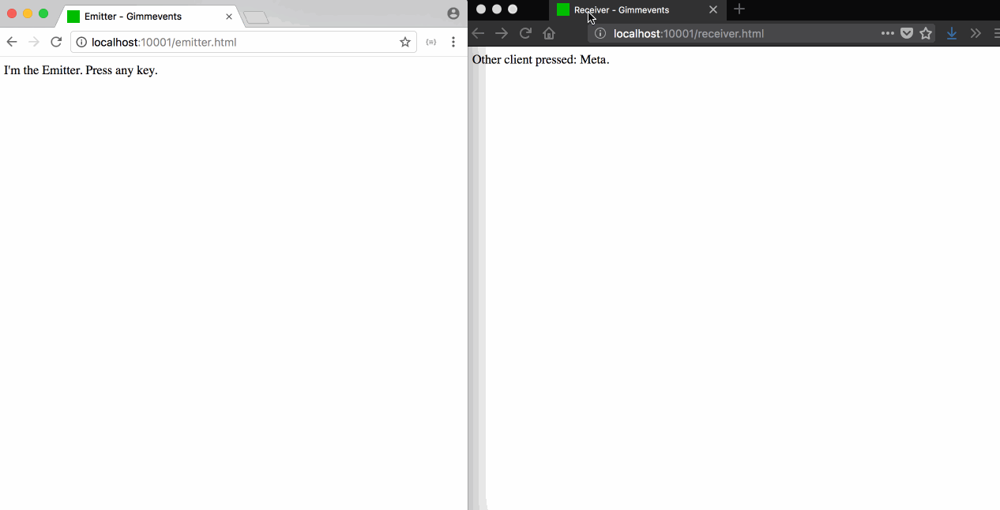

gimmevents
---
by [@michalbe](http://github.com/michalbe)

## WHAT?
[Gimmevents](https://github.com/michalbe/gimmevents) is a simple event tunnel that sends keyboard and mouse events from one browser to another. CLients needs to register with a unique key.

## WHY?
I don't have any VR controller what makes my [a-frame](https://github.com/aframevr/aframe) based games boring and non-interactive. With [Gimmevents](https://github.com/michalbe/gimmevents) I can render game on my VR set (for now it's just my phone) and still control it with my computer's keyboard or mouse.

## HOW?
[Gimmevents](https://github.com/michalbe/gimmevents) uses [WebSockets](https://developer.mozilla.org/en-US/docs/Web/API/WebSockets_API) and custom pairing system to send events from one browser to another.

### Keyboard events


## API
### Emitter
```javascript
const gimmevents = new Gimmevents.Emitter({
	key: my_unique_session_key,
	host: host
});

gimmevents.register(event);
```

### Receiver
```javascript
const gimmevents = new Gimmevents.Receiver({
	key: my_unique_session_key,
	host: host
});

gimmevents.on(event, (e) => {
 // Do stuff
});
```

## EVENTS
  - keyup
  - keydown
  - keypress
  - mousemove
  - mouseup
  - mousedown

## Development

```bash
git clone git@github.com:michalbe/gimmevents.git
cd gimmevents
npm i
npm run dev
```

then open [localhost:7100/emitter.html](http://localhost:7100/emitter.html) in one browser and [localhost:7100/receiver.html](http://localhost:7100/receiver.html) in another. Demo listened to all the keys pressed in one window and sends them to another.
